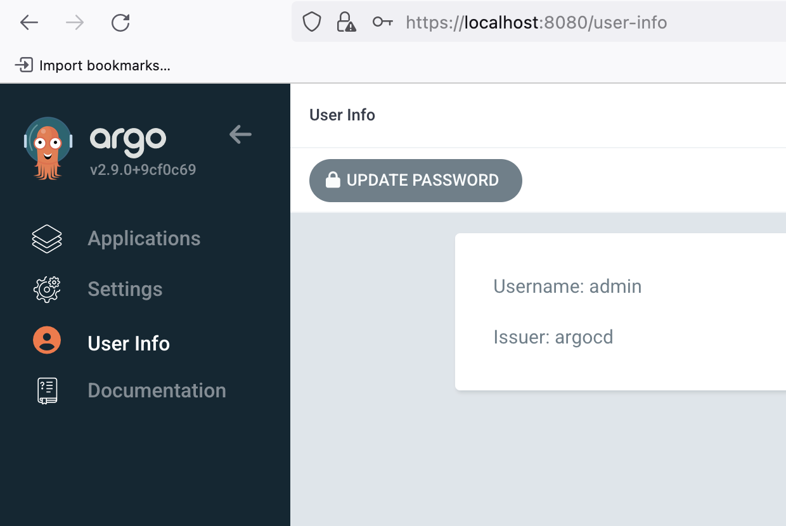

# 1 - Bootstrap

This step bootstraps the cluster. To execute it, run:
```
source bootstrap.sh
```

This script will install ArgoCD, and expose the server UI to `localhost:443`

After installing ArgoCD, use the following command to get the default admin password:
```
kubectl -n argocd get secret argocd-initial-admin-secret -o jsonpath="{.data.password}" | base64 -d
```
It is highly recommended that you navigate to *User Info*, then change the admin password.
